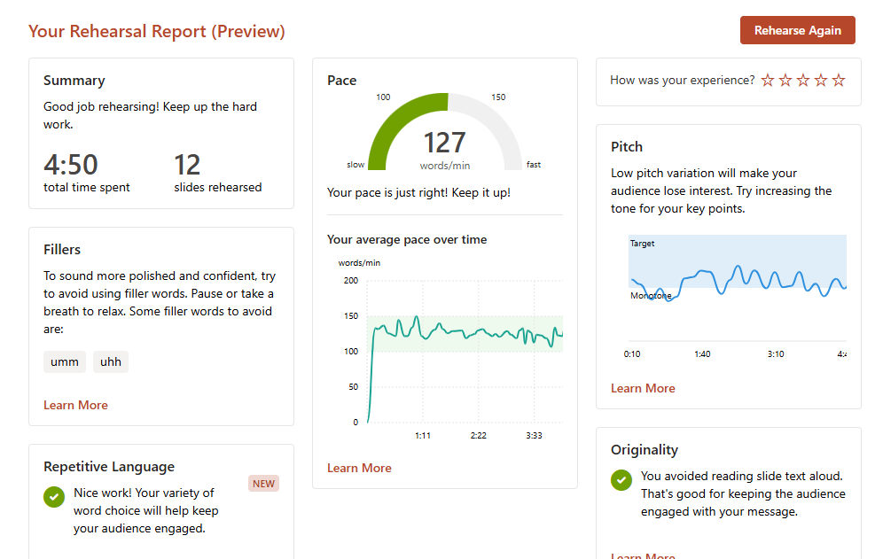
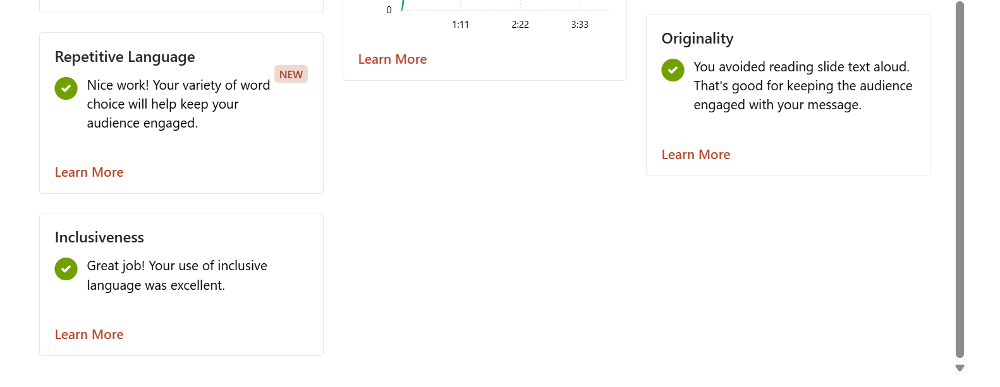

# A1 Rehearsal Presentation Feedback
[Slide](https://u.pcloud.link/publink/show?code=XZBSyLJZfqibhzNpDdLle1H7jhILXbmQdprX)
## Speaker Coach Recording

[Record video](https://u.pcloud.link/publink/show?code=XZxhyLJZ2m1MV3CGBDVo5GYYMhGTx45VWJy0)
## LLM Review

### 1. Rehearsal Overview

| Metric | Result | Feedback |
|---|---|---|
| Rehearsal Time | 4:50 | Close to the 5-minute limit |
| Average Pace | 127 wpm | Appropriate speaking pace |
| Slides Rehearsed | 12 | Approximately 24 seconds per slide |
| Fillers Detected | 2 types | "umm" and "uhh" |

### 2. Performance Analysis

#### Pace — Good

My average speaking pace was 127 words per minute, which Speaker Coach considered appropriate. My pace remained relatively stable throughout the presentation.

I should maintain my current speaking pace without trying to speak faster.

#### Pitch — Needs Improvement

Speaker Coach indicated that my pitch variation was limited, which could make the presentation less engaging.

I should use more vocal variation to emphasize key points, especially when introducing the research problem and explaining important results.

#### Fillers — Needs Improvement

Speaker Coach detected filler words such as "umm" and "uhh."

I should replace unnecessary filler words with short pauses to make my delivery clearer and more professional.

The report does not show the exact number of occurrences, so the frequency of filler words cannot be determined.

#### Originality — Good

Speaker Coach confirmed that I avoided reading directly from my slides, which helps keep the audience engaged.

#### Repetitive Language & Inclusiveness — Good

Speaker Coach provided positive feedback on my word choice and inclusive language. I should maintain these aspects of my presentation.

### 3. Improvement Plan

1. **Manage presentation time:** Aim for approximately 4:30–4:40 to allow time for natural pauses while staying within the five-minute limit.
2. **Emphasize key messages:** Use pauses, vocal emphasis, and intonation changes to highlight important points in the Problem, Method, and Expected Results sections.
3. **Reduce filler words:** Use short pauses instead of saying "umm" or "uhh" when transitioning between slides.

### 4. Overall Reflection

My speaking pace, originality, and language use were positive aspects of the rehearsal. My main priorities for the next rehearsal are improving pitch variation, reducing filler words, and managing presentation time more effectively.

