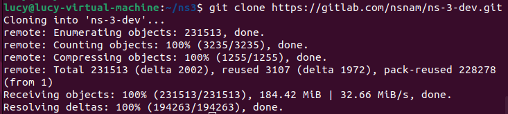
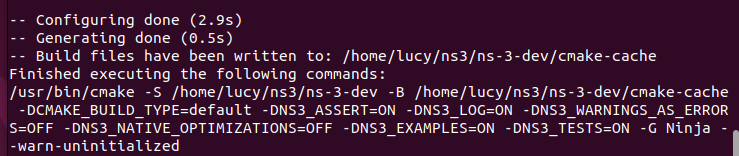
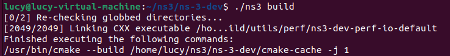
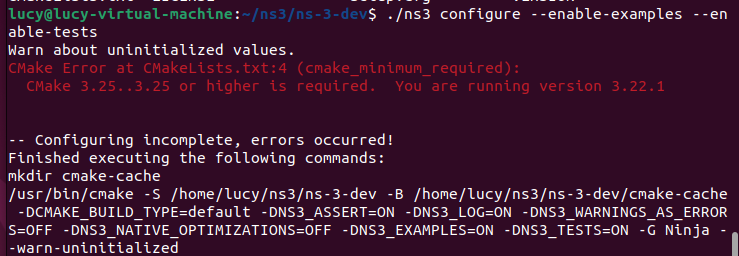
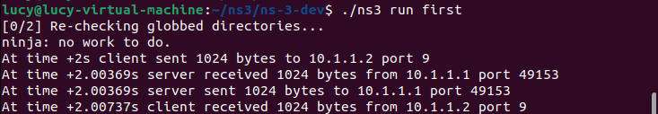

# A2 · ns-3 Setup and First Scenario

## Environment
```
Ubuntu       22.04.5 LTS
CMake        4.4.3
GCC          11.4.0
G++          11.4.0
Python       3.10.12
Git          2.34.1
Ninja        1.10.1
NS-3         ns-3.48-192-g9611dfcb5
Branch       master
```
## Installation Steps

### Install tools
```
sudo apt update

sudo apt install -y \
  g++ \
  cmake \
  ninja-build \
  git \
  python3 \
  python3-dev \
  python3-pip \
  python3-setuptools \
  python3-venv \
  sqlite3 \
  libsqlite3-dev \
  libxml2 \
  libxml2-dev \
  pkg-config
```

### Install ns3
Build a file
```
mkdir -p ~/ns3
cd ~/ns3
```
Install ns3 from Github
```
git clone https://gitlab.com/nsnam/ns-3-dev.git
```


### Compile NS-3
```
cd ~/ns3/ns-3-dev
./ns3 configure --enable-examples --enable-tests
```


```
./ns3 build
```

## Issues and Fixes



Because the release of Ubuntu is 22.04.5, need to update CMake
```
sudo apt update
sudo apt install -y software-properties-common

sudo apt remove -y cmake

sudo apt update

sudo apt install -y wget gpg

wget -O - https://apt.kitware.com/keys/kitware-archive-latest.asc 2>/dev/null | gpg --dearmor | sudo tee /usr/share/keyrings/kitware-archive-keyring.gpg >/dev/null

echo 'deb [signed-by=/usr/share/keyrings/kitware-archive-keyring.gpg] https://apt.kitware.com/ubuntu/ jammy main' | sudo tee /etc/apt/sources.list.d/kitware.list

sudo apt update
sudo apt install -y cmake
```
```
cmake --version //應該大於3.25
```


## First Scenario
[FirstScriptExample](https://www.nsnam.org/docs/release/3.43/doxygen/d7/da5/first_8cc_source.html?utm_source=chatgpt.com)
```
              Point-to-Point Link

        5 Mbps              2 ms delay
 n0  ===========[1024-byte packet]================  n1
10.1.1.1                           10.1.1.2

UDP Echo Client                UDP Echo Server
```
### 1. Node model
```
NodeContainer nodes;
nodes.Create(2);
```
### 2.NetDevice + Channel Model
```
PointToPointHelper pointToPoint;

// PointToPointNetDevice
pointToPoint.SetDeviceAttribute(
    "DataRate",
    StringValue("5Mbps")
);
// PointToPointChannel
pointToPoint.SetChannelAttribute(
    "Delay",
    StringValue("2ms")
);
```
### 3.Network / Transport Layer
```
InternetStackHelper stack;
stack.Install(nodes);
```
> InternetStackHelper 是把 IP/TCP/UDP functionality 加到Node

### 4.IP address
```
Ipv4AddressHelper address;

address.SetBase(
    "10.1.1.0", //IP
    "255.255.255.0" //Mask 
);

Ipv4InterfaceContainer interfaces =
    address.Assign(devices); //依序佈位址
```

到現在已經搭建的架構
```
        Node 0                         Node 1
           │                              │
          IP                             IP
           │                              │
           ▼                              ▼
      NetDevice                      NetDevice
           │                              │
           └──────── Channel ─────────────┘
```

### Application Model
```
UdpEchoServerHelper echoServer(9);

serverApps =
    echoServer.Install(nodes.Get(1));
```
> Node 1 現在有一個：UdpEchoServerApplication

```
UdpEchoClientHelper echoClient(
    interfaces.GetAddress(1),
    9
);
```
> Node 0 現在有一個：UdpEchoClientApplication

```
             Application Layer

n0                                  n1

UdpEchoClient                 UdpEchoServer
      │                              ▲
      ▼                              │
     UDP ────────────────────────── UDP
      │                              ▲
      ▼                              │
      IP ─────────────────────────── IP
```
#### Traffic model 
Client 最多產生 1 個 packet，每個 1024 bytes；如果有多個 packet，packet 間隔會是 1 秒。
```
echoClient.SetAttribute(
    "MaxPackets",
    UintegerValue(1)
);

echoClient.SetAttribute(
    "Interval",
    TimeValue(Seconds(1.0))
);

echoClient.SetAttribute(
    "PacketSize",
    UintegerValue(1024)
);
```
| ns-3 code / object                     | 你應該理解成                         | 層級                |
| -------------------------------------- | ------------------------------ | ----------------- |
| `Node`                                 | 網路設備容器                         | simulation entity |
| `UdpEchoClientApplication`             | 產生 application data            | Application       |
| `PacketSize`, `Interval`, `MaxPackets` | traffic 如何產生                   | Traffic Model     |
| `UDP`                                  | transport protocol             | Transport         |
| `IPv4`                                 | packet addressing / forwarding | Network           |
| `PointToPointNetDevice`                | network interface              | Link abstraction  |
| `DataRate=5Mbps`                       | device transmission capacity   | Link              |
| `PointToPointChannel`                  | 兩個 device 間的 link              | Channel           |
| `Delay=2ms`                            | propagation delay              | Channel           |
| `Simulator::Run()`                     | 執行所有 scheduled events          | Simulation core   |


## Results
### cmd
```
cd ns3/ns-3-dev
./ns3 run first
```


```
At time +2s client sent 1024 bytes to 10.1.1.2 port 9
```
代表在：

$$ t=2s $$

Node 0 上的 UdpEchoClientApplication 產生`1024 bytes`的 application payload 送給

Destination IP   = 10.1.1.2
Destination Port = 9

觀察：

Application / Traffic Model
```
UdpEchoClient
      ↓
產生 1024-byte data
```
> Traffic model 決定 application 

```
At time +2.00369s server received 1024 bytes from 10.1.1.1 port 49153
```
代表 packet 經過網路後，在大約：

$$ 2.00369s $$

抵達 Node 1。

也就是：
```
Client
  ↓
UDP
  ↓
IP
  ↓
PointToPointNetDevice
  ↓
PointToPointChannel
  ↓
PointToPointNetDevice
  ↓
IP
  ↓
UDP
  ↓
Server
```
所以從：

2.00000 s

到：

2.00369 s

大約花了：

$$ 3.69ms $$


first.cc 裡 Channel 設定的 Delay = 2ms，只是 Propagation delay。

packet 還需要先被 NetDevice 送出去

Point-to-point device 的：

DataRate = 5 Mbps

還存在：

Transmission / serialization delay

Application payload 是：

1024 bytes

但在真正送到 link 上以前還會加 header：
```
Application data     1024 bytes
        ↓
UDP header             8 bytes
        ↓
IPv4 header           20 bytes
        ↓
PPP header             2 bytes
```
$$ 1024+8+20+2=1054\ bytes $$

因此 transmission time：

$$ T_{tx} = \frac{1054\times8}{5\times10^6} $$

大約：

$$ T_{tx}=1.6864ms $$

再加 channel propagation delay：

$$ T_{prop}=2ms $$

所以：

$$ T_{total} = T_{tx}+T_{prop} $$ $$ =1.6864+2 $$ $$ =3.6864ms $$

因此：
```
2.0000000 s
      +
0.0036864 s
      ↓
2.0036864 s
```
log 顯示成：
```
2.00369 s
```
完全對得上。

```

DataRate
   │
   └─→ Transmission Delay

Channel Delay
   │
   └─→ Propagation Delay
```
加起來=實際 packet arrival time

```
At time +2.00369s server sent 1024 bytes to 10.1.1.1 port 49153
```
Server 收到之後立即Echo

因此：
```
2.00369s receive
2.00369s send
```
時間幾乎一樣。

這是 UdpEchoServerApplication 的 application behavior。

```

server received from 10.1.1.1 port 49153
```

Client 是：
```
Source:
10.1.1.1 : 49153

Destination:
10.1.1.2 : 9
```
可以想成：
```
Node 0                                Node 1

10.1.1.1:49153  ───────────────→  10.1.1.2:9
    Client                             Server
```
9 是 Server listening port。

49153 是 Client 這邊自動取得的 source port。

Server 要回覆時：
```
10.1.1.2:9  ───────────────────→  10.1.1.1:49153
```
這是 UDP socket 的概念。
```

At time +2.00737s client received 1024 bytes from 10.1.1.2 port 9
```
Server echo 回去又要經歷一次：

$$ 1.6864ms + 2ms = 3.6864ms $$

所以：

$$ 2.0036864 + 0.0036864 = 2.0073728s $$

log：
```
2.00737s
```

因此整個 round trip：

$$ RTT \approx 7.37ms $$

可以拆成：
```
Forward:
Tx delay   1.6864 ms
Prop delay 2.0000 ms

Return:
Tx delay   1.6864 ms
Prop delay 2.0000 ms

--------------------
Total      7.3728 ms
```
```
Node 0                                      Node 1
10.1.1.1                                   10.1.1.2

UdpEchoClient                            UdpEchoServer
     │                                        ▲
     │ 1024 bytes                             │
     ▼                                        │
    UDP                                      UDP
     │                                        ▲
     ▼                                        │
    IP                                       IP
     │                                        ▲
     ▼                                        │
PointToPointNetDevice                PointToPointNetDevice
     │                                        ▲
     └──────── PointToPointChannel ────────────┘
```


